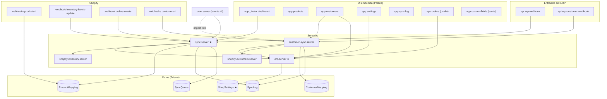

# graphify-out — Grafo del codebase `bh-shopify-app`

Grafo de conocimiento persistente del codebase (generado 2026-07-16, commit `0a05dea`).
**Business Hub Shopify App**: app embebida Remix que sincroniza inventario, clientes y pedidos entre Shopify y el ERP Business Hub, con persistencia Prisma.

## Contenido

| Archivo | Qué es |
|---|---|
| `graph.json` | Nodos (43), aristas (78), comunidades, god nodes y hallazgos |
| `query.mjs` | Herramienta de consulta: `query`, `node`, `explain`, `path`, `gods`, `communities`, `findings` |

```bash
node graphify-out/query.mjs query inventario
node graphify-out/query.mjs explain sync.server
node graphify-out/query.mjs path route:webhooks.orders-create model:ShopSettings
node graphify-out/query.mjs gods
```

## Vista general



(`★` = god node. `shopify.server` y `db.server` se omiten del diagrama porque conectan con casi todo: autenticación y Prisma respectivamente.)

## Comunidades

1. **core-infra** — arranque Remix, `shopify.server` (auth/sesiones), `db.server`, layout, login, healthcheck.
2. **product-sync** — el dominio principal: inventario bidireccional Shopify↔ERP (`sync.server` + `erp.server` + `shopify-inventory.server`, webhooks de productos/inventario, endpoint entrante del ERP, dashboard).
3. **customer-sync** — clientes bidireccional con metafields y campos custom.
4. **orders** — pedidos Shopify → ventas ERP (webhook y página manual hoy oculta).
5. **admin-ui** — settings, bitácora de sync, mapeo de campos custom (oculta).
6. **jobs** — `cron.server` (no arrancado por ningún entrypoint).
7. **data** — 7 modelos Prisma; `ShopSettings` es el pivote de configuración multi-tienda.

## God nodes (mayor acoplamiento)

| Nodo | in-degree | Impacto de un cambio |
|---|---|---|
| `shopify.server` | 19 | Todas las rutas autentican por aquí |
| `db.server` | 13 | Todo acceso a datos |
| `model:ShopSettings` | 7 | Config por tienda leída en todos los flujos |
| `erp.server` | 5 | Única puerta al ERP; cambios de contrato del ERP se propagan desde aquí |
| `sync.server` | 5 | Orquestador del dominio de inventario |

## Hallazgos

- **[high]** `app/cron.server.js:11` importa `fullSyncCustomersErpToShopify`, pero `customer-sync.server.js` solo exporta `fullSyncCustomersShopifyToErp`. Si algo llegara a importar `cron.server.js`, el módulo fallaría al cargar. Hoy no rompe nada porque **nadie llama a `startCron()`** — el cron es código latente.
- **[info]** `app.orders` y `app.custom-fields` siguen desplegadas pero ocultas del `NavMenu` (commit `bd940f7`).
- **[info]** `shopify.server.js` crea su propio `PrismaClient` en vez de reutilizar el singleton de `db.server.js` (dos pools contra la misma base).
